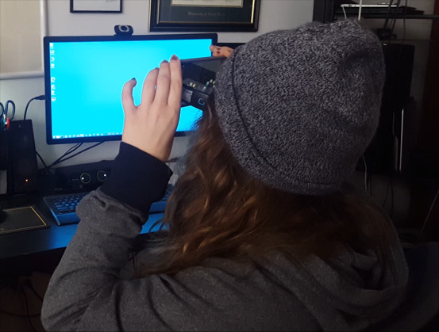

# Introduction
VR Puzzler is a Virtual Reality based puzzle game set in a dark dungeon. The viewer enters a dungeon and must solve a simple memory puzzle (similar to Simon Says) in order to exit the dungeon. Upon completion the user is given the option to play again.

# Development Process
The process to develop this VR game consisted of several stages:
* Creating wireframe sketches to depict the environment and UI layouts.
* Building the environment and scripting interactions.
* Testing the initial version with users and collecting feedback.
* Implementing feedback and building final version
   
## Wireframes
Below are a few of my initial wireframes.

The Environment wireframe shows the starting position (1), the playing position (2) and the end position (3)

The UI Wireframe shows the starting and ending (restart) UI dialogs.
        
## Building Environment
To build the environment I started with some dungeon prefabs already provided. I then duplicated pieces such as walls, floor, and roof elements and positioned them until I had a fully enclosed dungeon of sufficient size. 

The image below shows the final dungeon with game orbs before lighting was implemented.
  

  
Once the dungeon was fully modeled I added lights and adjusted them until they created the desired effect. The image below shows the final lighting effect in one of the corners of the dungeon.

        
## User Testing
I tested the game with my girlfriend, Emily. I would not consider Emily a gamer although she has tried some VR applications (at my behest) before. 

        
Emily had no trouble figuring out how to play the game and was successful on her first attempt. The main feedback I received from her was:
* There should be more puzzles
* The viewing angle seemed relatively low

## Final Build
Based on my user testing feedback I raised the viewing position along the Y axis.

You can see a quick demonstration of the final build in the video below.

<iframe width="560" height="315" src="https://www.youtube.com/embed/R4BtrslHDg8" frameborder="0" allowfullscreen></iframe>
        
# Conclusion
The VR Puzzler project was a fun little project to practice building VR interactivity from start to finish.

In the future I might expand on this project to increase the size of the dungeon and add more waypoints with multiple puzzles.